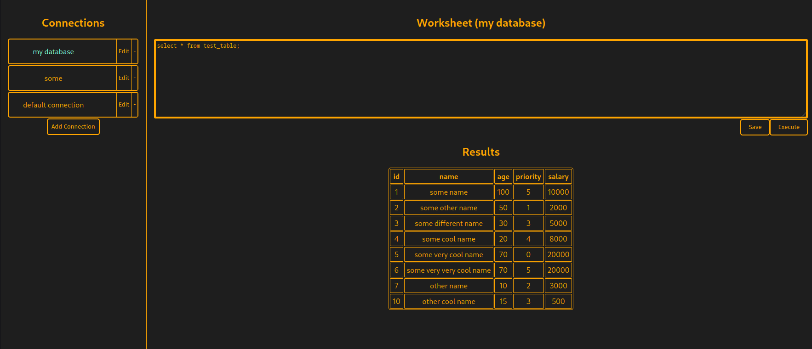
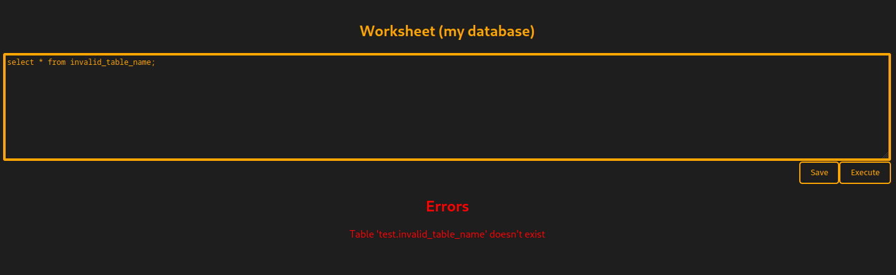
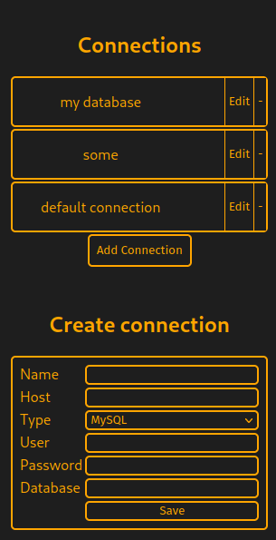

# SQL Client Connector

## Connect to relational databases

## Features:
- dark mode :)
- connect to database
- store connection
- run sql commands
- display query results
- store session
- error handling

## Supported Databases:
- MySQL
- PostgreSQL

## UI Repo:
[SQL Client](https://github.com/jaromaster/sql-client)

# UI:

# Error:

# Add or edit:

# Build:
`git clone https://github.com/jaromaster/sql-client-connector.git` 
`git clone https://github.com/jaromaster/sql-client.git` (UI) 
In UI repo: 
`npm run build` 
Copy build-directory to cloned sql-client-connector and build it: 
`deno compile --allow-read --allow-write --allow-env --allow-net main.ts` 
Run: 
`./sql-client-connector` 
Access UI:  
`http://localhost:8000`